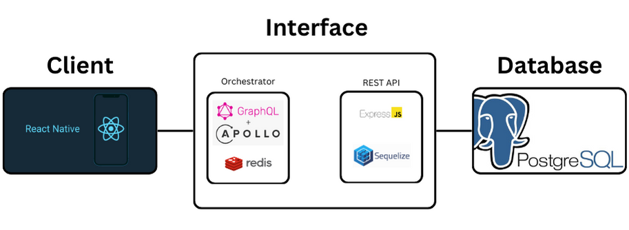
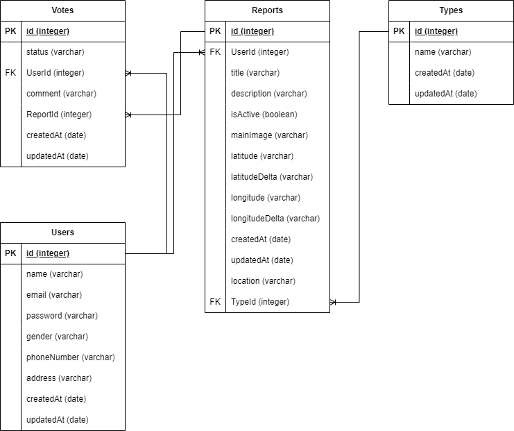
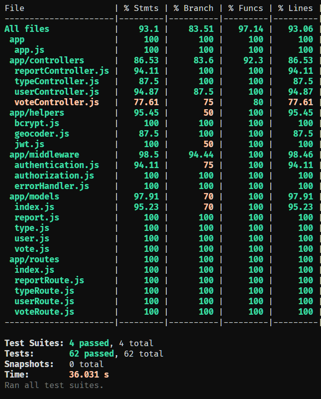

# Safer

Safer is an application that facilitates the submission of geotagged images, showcasing high-risk locations and enabling the public to avoid these vulnerable areas. This application also serves as a valuable resource for police departments. Users have the ability to cast votes and provide comments on these high-risk locations. Furthermore, our system provides a verification mechanism to identify counterfeit posts. In cases where a post accumulates a certain number of negative votes, it is automatically flagged and removed from public view

This project aims to fulfill One of the 17 Sustainability & Development Goals set by the UN: [Sustainable cities and communities](https://indonesia.un.org/en/sdgs/11/key-activities)

## Technical Overview

### Tech Stack

- React Native Expo
- Graphql + Apollo GraphQL
- GraphQL Server
- Redis Cache
- ExpressJS
- Sequelize ORM
- PostgreSQL Database

This project integrates Google Maps and Cloudinary 3rd party API

### Database Schema

### Results of Integration Tests

## How to Run

### Front-end

go to the `client-mobile` directory, first run `npm install`, then run `npm start`

### Back-end

This repository is created of two services - the REST API (`server/services/app` directory) and the GraphQL server (`server/orchestrator` directory).

To create, migrate the database in a development and testing environment, go to the `server/services/app` directory, first run `npm install`, then run `bash dbsetup-sequelize.sh`, for testing run `npm run test` in the `server/services/app` directory.

To run the server, open the directory of each service, setup the `.env` file for each directory, and then run the command `npm start`.

## API Documentation

API Documentation: [server/services/app/api-documentation.md](server/services/app/api-documentation.md) 
