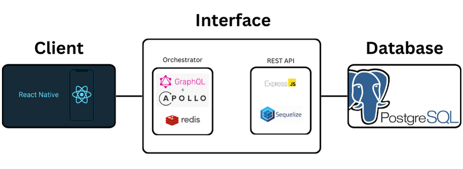

# Safer

Safer is an application that facilitates the submission of geotagged images, showcasing high-risk locations and enabling the public to avoid these vulnerable areas. This application also serves as a valuable resource for police departments. Users have the ability to cast votes and provide comments on these high-risk locations. Furthermore, our system provides a verification mechanism to identify counterfeit posts. In cases where a post accumulates a certain number of negative votes, it is automatically flagged and removed from public view

This project aims to fulfill One of the 17 Sustainability & Development Goals set by the UN: [Sustainable cities and communities](https://indonesia.un.org/en/sdgs/11/key-activities)

## Application Demo

## Technical Overview

### Tech Stack

- PostgreSQL Database
- Express REST API
- ORM Sequelize
- GraphQL Server
- Redis Cache
- Docker Containers

### Database Schema

### Results of Integration Tests

79 unit tests have been run successfully, achieving an average coverage of **90%**.

## How to Run

This repository is composed of two services - the REST API (`express-app` directory) and the GraphQL server (`graphql` directory).

To create, migrate, and seed the database in a development and testing environment, go to the `express-app` directory, then run `bash dbsetup-sequelize.sh`. [Requires sequelize-cli]

To run the server, open the directory of each service, setup the `.env` file for each directory, and then run the command `npm run dev`.

The branch `deployment` is provided for ready shipping to production. In this branch, Dockerfiles have been provided for easier setup.

# LaguDB - Server

Lagu - Indonesian for "song".

Modelled after Last.fm, Discogs, and VocaDB, LaguDB is an aggregate platform for musical artists, songs, and the like. With LaguDB you can follow your favourite artists and keep updated on their latest songs. In addition, LaguDB also has a novel feature - auto-timed lyrics, or lyrics that play along with the music video in real time.

API Documentation: [Link](api-documentation.md) 
Front-end Client (Vue) (proof of concept): [Link](https://github.com/ValYauw/lagu-db-vue-client)

## Application Demo

### Basic UI

### Browse Songs and Artists

### MVP - Lyrics change alongside the music

## Tech Stack & Features

- Monolithic Architecture (Express.js REST API)
- PostgreSQL Database
- ORM Sequelize
- Google Login (OAuth)
- CRUD (Create, Read, Update, Destroy) songs, albums, artists
- Integration with Third Party APIs (YouTube Data and VocaDB public API)
- Integration with the YouTube IFrame API on the front-end to render auto-timed lyrics

## Database Schema

## How to run

`npm install`

Install packages and dependencies.

`bash dbsetup-sequelize.sh`

Migrates and seeds database in development and testing environments. [Requires sequelize-cli]

Database configuration options can be changed in `config/config.json`.

`npm run dev`

Start Node.js application.

`bash dbdrop-sequelize.sh`

Drops the database in development and testing environments. [Requires sequelize-cli]

`npm run test`

Run tests.

## Current State of Development (_October 11, 2023_)

- Finished 28 entrypoints for CRUD (Create, Read, Update, Destroy).
- Passed 164 unit tests with [85% coverage](__tests__/integration-test-results.PNG).
- Finished a basic front-end web application showcasing read & search features and the auto-timed lyrics playback feature.

## Stretch Goals

- Database Optimization
- UI Redesign of Front-end Code, possibly using React.js instead of Vue.js + Vuetify.
